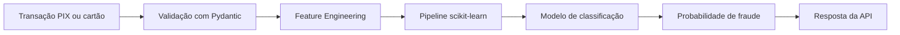
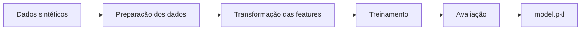

# 🛡️ Fraud Scoring API

### Machine Learning aplicado à detecção de fraude em transações bancárias e PIX


---

## Objetivo

Reestruturar o README do projeto para melhorar a documentação técnica e apresentar com mais clareza o problema de negócio relacionado à detecção de fraude.

## Alterações

- Adição da visão geral do projeto;
- Documentação do problema de negócio;
- Inclusão da arquitetura da solução;
- Detalhamento das variáveis utilizadas;
- Melhoria das instruções de instalação e execução;
- Inclusão de exemplos de requisição e resposta;
- Documentação das limitações;
- Criação do roadmap de evolução;
- Inclusão de orientações de segurança e privacidade.

---


## 📌 Visão geral

Instituições financeiras precisam avaliar grandes volumes de transações em pouco tempo, equilibrando a identificação de possíveis fraudes com a redução de bloqueios indevidos de clientes legítimos.

A **Fraud Scoring API** demonstra uma arquitetura simplificada de Machine Learning para classificação de risco em transações de cartão e PIX.

A solução recebe os dados de uma transação, valida o payload, executa o processamento das variáveis e utiliza um modelo supervisionado para retornar:

- Probabilidade estimada de fraude;
- Classificação final da transação;
- Resposta estruturada por uma API REST;
- Documentação automática com Swagger/OpenAPI.

> Este projeto utiliza exclusivamente dados sintéticos e possui finalidade educacional e demonstrativa. Nenhum dado bancário real, pessoal ou confidencial é utilizado.

---

## 🎯 Problema de negócio

Soluções de detecção de fraude precisam lidar com dois erros importantes:

### Falso positivo

Uma transação legítima é classificada como fraude.

Isso pode causar:

- Bloqueio indevido;
- Insatisfação do cliente;
- Abandono da compra;
- Aumento de chamados;
- Perda de receita.

### Falso negativo

Uma transação fraudulenta é classificada como legítima.

Isso pode causar:

- Prejuízo financeiro;
- Chargeback;
- Exposição operacional;
- Risco regulatório;
- Danos à reputação.

Por isso, a avaliação de um modelo de fraude não deve considerar somente a acurácia. Métricas como **precision, recall, F1-score, ROC-AUC e PR-AUC** também precisam ser analisadas.

---

## ✨ Principais funcionalidades

- Geração de dados sintéticos de transações;
- Preparação e transformação das variáveis;
- Tratamento de atributos numéricos e categóricos;
- Treinamento de modelo supervisionado;
- Persistência do modelo treinado;
- Armazenamento dos nomes das features;
- Cálculo da probabilidade de fraude;
- Classificação da transação com threshold configurado;
- Validação dos payloads com Pydantic;
- API REST desenvolvida com FastAPI;
- Documentação automática com Swagger;
- Endpoint para verificação da saúde da aplicação;
- Testes automatizados com Pytest;
- Execução local ou conteinerizada com Docker;
- Makefile com atalhos para as principais operações.

---

## 🏗️ Arquitetura da solução



### Fluxo de treinamento



---

## 🧠 Modelo de Machine Learning

O projeto utiliza um modelo `GradientBoostingClassifier`, disponibilizado pelo scikit-learn.

Durante o treinamento, a solução:

1. Gera dados sintéticos de transações;
2. Separa as variáveis explicativas e a variável-alvo;
3. Transforma as variáveis categóricas;
4. Normaliza ou prepara as variáveis numéricas;
5. Treina o modelo supervisionado;
6. Persiste o pipeline treinado;
7. Armazena os nomes das features utilizadas.

### Variáveis utilizadas

| Variável | Tipo | Descrição |
|---|---|---|
| `amount` | Numérica | Valor financeiro da transação |
| `merchant_risk_score` | Numérica | Score de risco associado ao estabelecimento |
| `device_trust_score` | Numérica | Grau de confiança atribuído ao dispositivo |
| `channel` | Categórica | Canal utilizado na transação, como PIX ou cartão |
| `hour` | Numérica | Hora em que a transação foi realizada |
| `country` | Categórica | País de origem da transação |
| `user_txn_24h` | Numérica | Quantidade de transações realizadas pelo usuário nas últimas 24 horas |

### Saída atual do modelo

O modelo retorna:

- `fraud_probability`: probabilidade estimada entre `0` e `1`;
- `is_fraud`: classificação final com base no threshold padrão de `0.5`.

> O threshold de `0.5` foi adotado como ponto inicial. Em um cenário real, esse valor deveria ser ajustado de acordo com o custo financeiro dos falsos positivos e falsos negativos.

---

## 🛠️ Tecnologias utilizadas

### Linguagem e análise de dados

- Python 3.10+
- Pandas
- NumPy
- scikit-learn
- Joblib

### API e validação

- FastAPI
- Uvicorn
- Pydantic
- OpenAPI
- Swagger

### Qualidade e execução

- Pytest
- FastAPI TestClient
- Docker
- Makefile

---

## 📁 Estrutura do projeto

```text
fraud_scoring_api/
├── src/
│   ├── __init__.py
│   ├── api.py
│   ├── schema.py
│   ├── train.py
│   └── utils.py
├── tests/
│   └── test_api.py
├── model/
│   ├── model.pkl
│   └── feature_names.json
├── Dockerfile
├── Makefile
├── requirements.txt
└── README.md
```

### Responsabilidade dos arquivos

| Arquivo | Responsabilidade |
|---|---|
| `src/train.py` | Geração dos dados sintéticos e treinamento do modelo |
| `src/api.py` | Inicialização da API e definição dos endpoints |
| `src/schema.py` | Validação dos dados de entrada e saída com Pydantic |
| `src/utils.py` | Feature engineering, transformação e persistência do modelo |
| `tests/test_api.py` | Testes automatizados dos endpoints |
| `Dockerfile` | Construção da imagem Docker |
| `Makefile` | Atalhos para instalação, treinamento, testes e execução |
| `requirements.txt` | Dependências necessárias para executar o projeto |

---

## ⚙️ Como executar localmente

### Pré-requisitos

Antes de começar, verifique se possui:

- Python 3.10 ou superior;
- Git;
- Pip;
- Docker, caso queira executar a versão conteinerizada.

### 1. Clone o repositório

```bash
git clone https://github.com/biancafsena/fraud_scoring_api.git
cd fraud_scoring_api
```

### 2. Crie o ambiente virtual

#### macOS ou Linux

```bash
python3 -m venv .venv
source .venv/bin/activate
```

#### Windows — Prompt de Comando

```bash
python -m venv .venv
.venv\Scripts\activate
```

#### Windows — PowerShell

```powershell
python -m venv .venv
.venv\Scripts\Activate.ps1
```

### 3. Instale as dependências

```bash
pip install --upgrade pip
pip install -r requirements.txt
```

### 4. Treine o modelo

```bash
python -m src.train --n-samples 50000
```

Após a execução, serão gerados:

```text
model/model.pkl
model/feature_names.json
```

### 5. Inicie a API

```bash
uvicorn src.api:app --reload --port 8000
```

A aplicação estará disponível em:

```text
http://127.0.0.1:8000
```

A documentação interativa estará disponível em:

```text
http://127.0.0.1:8000/docs
```

---

## 🔌 Endpoints

| Método | Endpoint | Descrição |
|---|---|---|
| `GET` | `/health` | Verifica se a API está disponível |
| `POST` | `/predict` | Calcula a probabilidade de fraude da transação |
| `GET` | `/docs` | Abre a documentação interativa do Swagger |
| `GET` | `/openapi.json` | Retorna o contrato OpenAPI da aplicação |

---

## ❤️ Verificação de saúde

### Requisição

```bash
curl -X GET "http://127.0.0.1:8000/health"
```

A estrutura exata da resposta pode ser consultada diretamente na documentação Swagger da aplicação.

---

## 📤 Exemplo de requisição

```bash
curl -X POST "http://127.0.0.1:8000/predict" \
  -H "Content-Type: application/json" \
  -d '{
    "amount": 325.5,
    "merchant_risk_score": 0.75,
    "device_trust_score": 0.30,
    "channel": "PIX",
    "hour": 2,
    "country": "BR",
    "user_txn_24h": 5
  }'
```

### Payload utilizado

```json
{
  "amount": 325.5,
  "merchant_risk_score": 0.75,
  "device_trust_score": 0.30,
  "channel": "PIX",
  "hour": 2,
  "country": "BR",
  "user_txn_24h": 5
}
```

---

## 📥 Exemplo de resposta

A probabilidade exata depende do modelo treinado e dos dados sintéticos gerados durante a execução.

```json
{
  "fraud_probability": 0.87,
  "is_fraud": true
}
```


### Interpretação da resposta

- `fraud_probability`: probabilidade estimada de a transação apresentar comportamento fraudulento;
- `is_fraud`: classificação final calculada com base no threshold definido pelo modelo;
- Valores mais próximos de `1` representam maior risco estimado;
- O threshold padrão utilizado nesta versão é `0.5`.

Neste exemplo, a transação recebeu uma probabilidade estimada de fraude de `87%`. Como o valor ficou acima do threshold de `0.5`, ela foi classificada como uma possível fraude.

Em um cenário produtivo, essa resposta poderia ser utilizada para:

- Aprovar automaticamente transações de baixo risco;
- Solicitar autenticação adicional em casos intermediários;
- Encaminhar transações de alto risco para análise;
- Bloquear temporariamente operações críticas.

> A classificação é demonstrativa e utiliza dados sintéticos. O resultado não deve ser utilizado para decisões financeiras reais.

---

## 🐳 Executando com Docker

### 1. Construa a imagem

```bash
docker build -t fraud-api:latest .
```

### 2. Execute o contêiner

```bash
docker run --rm -p 8000:8000 fraud-api:latest
```

### 3. Acesse a documentação

```text
http://127.0.0.1:8000/docs
```

### 4. Interrompa a aplicação

No terminal em que o Docker está sendo executado, utilize:

```text
Ctrl + C
```

---

## 🧪 Executando os testes

Execute:

```bash
pytest -q
```

Para obter uma saída mais detalhada:

```bash
pytest -v
```

Os testes utilizam o `TestClient` do FastAPI para validar o comportamento da API.

### Cenários importantes para testes

- Retorno correto do endpoint `/health`;
- Predição realizada com um payload válido;
- Rejeição de valores inválidos;
- Validação dos campos obrigatórios;
- Validação dos tipos recebidos;
- Verificação dos campos presentes na resposta.

---

## 📊 Avaliação do modelo

Em problemas de fraude, a distribuição das classes costuma ser desbalanceada. Por isso, avaliar apenas a acurácia pode produzir uma visão enganosa do desempenho.

As principais métricas recomendadas para a evolução deste projeto são:

| Métrica | Interpretação |
|---|---|
| Precision | Entre os casos classificados como fraude, quantos realmente eram fraude |
| Recall | Entre todas as fraudes existentes, quantas foram identificadas |
| F1-score | Equilíbrio entre precision e recall |
| ROC-AUC | Capacidade geral de separação entre as classes |
| PR-AUC | Desempenho de precision e recall em dados desbalanceados |
| Matriz de confusão | Quantidade de acertos e erros por classe |

Os resultados devem ser recalculados sempre que o conjunto de dados, as regras de geração ou o modelo forem modificados.

> Como os dados são sintéticos, as métricas representam somente o comportamento do modelo dentro da simulação. Elas não devem ser interpretadas como desempenho esperado em produção.

---

## 🔐 Segurança e privacidade

Este repositório:

- Não utiliza dados reais de clientes;
- Não armazena informações bancárias;
- Não contém credenciais de produção;
- Não realiza conexão com instituições financeiras;
- Não deve ser utilizado diretamente para aprovar ou bloquear transações reais.

Em uma aplicação produtiva, também seriam necessários:

- Autenticação e autorização;
- Criptografia em trânsito;
- Gestão segura de credenciais;
- Logs estruturados;
- Mascaramento de informações sensíveis;
- Controle de acesso;
- Rate limiting;
- Auditoria das decisões;
- Monitoramento de disponibilidade;
- Políticas de retenção de dados.

---

## ⚠️ Limitações

Esta versão possui algumas limitações intencionais:

- Os dados utilizados são sintéticos;
- O modelo não foi validado com transações bancárias reais;
- O threshold utiliza o valor inicial de `0.5`;
- Não existe autenticação na API;
- Não existe monitoramento de data drift ou model drift;
- Não existe banco de dados para registrar as predições;
- O modelo é carregado localmente;
- A aplicação não representa uma arquitetura bancária produtiva;
- As probabilidades não devem ser utilizadas para decisões financeiras reais.

Essas limitações foram documentadas para deixar claro o escopo atual e orientar as próximas evoluções do projeto.

---

## 🗺️ Roadmap

### Machine Learning

- [ ] Adicionar relatório completo de métricas;
- [ ] Gerar matriz de confusão;
- [ ] Calcular ROC-AUC e PR-AUC;
- [ ] Comparar diferentes algoritmos;
- [ ] Ajustar o threshold de classificação;
- [ ] Implementar explicabilidade com SHAP;
- [ ] Avaliar calibração das probabilidades.

### API

- [ ] Adicionar classificação por nível de risco;
- [ ] Retornar o threshold utilizado;
- [ ] Retornar a versão do modelo;
- [ ] Implementar autenticação;
- [ ] Adicionar tratamento centralizado de erros;
- [ ] Implementar logs estruturados;
- [ ] Adicionar endpoint de informações do modelo.

### MLOps

- [ ] Criar pipeline de integração contínua;
- [ ] Automatizar os testes com GitHub Actions;
- [ ] Versionar modelo e dados;
- [ ] Implementar rastreamento de experimentos;
- [ ] Monitorar data drift e model drift;
- [ ] Adicionar métricas de observabilidade;
- [ ] Preparar estratégia de deploy em cloud.

### Documentação

- [ ] Adicionar imagens do Swagger;
- [ ] Criar GIF demonstrando uma predição;
- [ ] Documentar decisões de arquitetura;
- [ ] Adicionar Model Card;
- [ ] Criar documentação sobre análise de risco.

---

## 💡 Próximas versões planejadas

Uma futura resposta da API poderá apresentar mais contexto sobre a decisão:

```json
{
  "fraud_probability": 0.8734,
  "risk_level": "HIGH",
  "is_fraud": true,
  "threshold": 0.5,
  "model_version": "1.1.0"
}
```

> Essa estrutura representa uma evolução planejada e ainda não deve ser considerada parte da resposta atual da API.

---

## 🤝 Contribuições

Contribuições são bem-vindas.

Para contribuir:

1. Faça um fork do projeto;
2. Crie uma branch para sua funcionalidade;
3. Implemente e teste a alteração;
4. Crie um commit descritivo;
5. Envie a branch para seu fork;
6. Abra um Pull Request explicando a mudança.

Exemplo:

```bash
git checkout -b feature/new-feature
git add .
git commit -m "feat: add new feature"
git push origin feature/new-feature
```

---

## 👩‍💻 Autora

**Bianca Sena**

Senior Data Scientist com atuação em Data Science, Machine Learning, Cybersecurity Analytics, Financial Risk e projetos de dados para ambientes financeiros e regulados.

[](https://www.linkedin.com/in/biancafsena)
[](https://github.com/biancafsena)
[](mailto:bia.bianca.sena@gmail.com)

---

## ⭐ Apoie o projeto

Se este projeto ajudou você a compreender a aplicação de Machine Learning em classificação de risco e detecção de fraude, considere deixar uma estrela no repositório.

Ela ajuda o projeto a alcançar mais pessoas interessadas em Data Science, Financial Risk e Machine Learning.

<div align="center">

**Data Science · Machine Learning · Fraud Detection · Financial Risk · FastAPI · MLOps**

</div>
